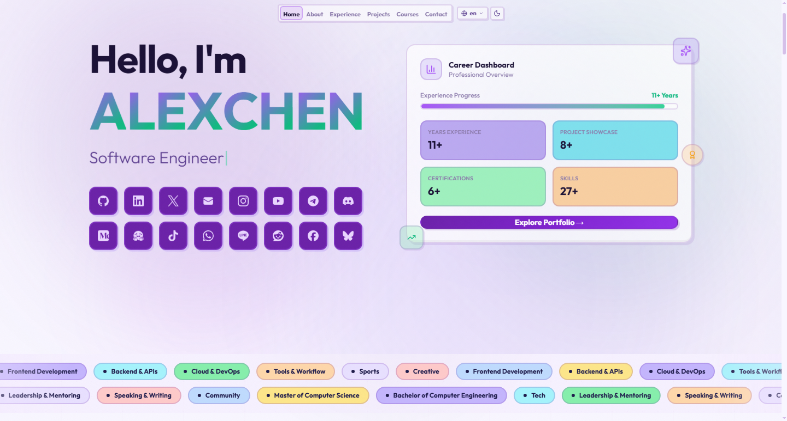

<h1 align="center">Crafted Personal Experience — Portfolio</h1>



Built for those who create, not just those who code. This is a streamlined personal portfolio website designed to turn your professional journey into a clean visual experience. Forget complex setups—everything you see is powered by a single data file. It’s modular, fully responsive, and crafted to let your work do the talking while the system handles the layout.

## Features

- **Single-file content** — All portfolio data lives in `src/data/content.ts`. Update your name, bio, experience, projects, courses, socials, and footer from one place.
- **Admin dashboard** — Edit content from any browser `your-domain/admin` without touching code. JWT-authenticated.
- **8 languages** — English, Japanese, Chinese, Indonesian, Arabic (RTL), Russian, German, French.
- **Project categories** — All / Featured / Works / Side-B filters with auto-slide carousel for Works.
- **About tabs** — Skills, Education, Hobbies, Other — all configurable from `content.ts`.
- **Performance optimized** — FPS-capped canvas background, viewport-only rendering, lazy loading, `content-visibility: auto`.
- **SEO** — Dynamic Open Graph, Twitter cards, sitemap.xml, robots.txt.
- **Donate section** — PayPal, ETH, BTC with QR codes and copy-to-clipboard.
- **Responsive** — Mobile-first design with compact navigation.

## Content Structure

All data is managed via `src/data/content.ts`. Below is every configurable block:

| Export | Section | Description |
|---|---|---|
| `roles` | Hero | Typewriter roles displayed after your name |
| `siteConfig.name` | Global | Display name, SEO title, avatar, domain URL |
| `siteConfig.heroDescription` | Hero | Description text below typewriter roles |
| `siteConfig.socials` | Hero + Contact + Footer | Social links — GitHub, LinkedIn, Twitter, Instagram, YouTube, Telegram, Discord, Medium, HuggingFace, etc. |
| `siteConfig.quote` | Contact | Quote text and author shown in contact section |
| `statsConfig` | Hero + About | Manual stats — Years Experience, Languages (others auto-counted) |
| `aboutData.intro` / `bio` | About | Bold intro paragraph and detailed bio |
| `aboutData.skills` | About → Skills tab | Array of `{ category, items[] }` — add/remove freely |
| `aboutData.education` | About → Education tab | Array of `{ degree, institution, year, description }` |
| `aboutData.hobbies` | About → Hobbies tab | Array of `{ category, items[] }` |
| `aboutData.other` | About → Other tab | Array of `{ category, items[] }` — optional activities |
| `aboutData.stats` | Hero + About | Auto-computed from data — `{ label, value }` |
| `experienceData` | Experience | Work history — `id, role, company, companyUrl, jobs, location, period, description, highlights[], skills[]` |
| `projectsData` | Projects → Side-B | Tech projects — `id, title, description, image, tags[], liveUrl, githubUrl, repoVisibility, featured` |
| `projectsData` (works) | Projects → Works | Professional projects — `id, title, description, images[], location, type: "works", featured` |
| `coursesData` | Courses | Certificates — `id, title, provider, providerIcon (emoji), date, credentialUrl, description, skills[]` |
| `navTabs` | Navigation | Tab order — `{ id, label }` mapped to section IDs |
| `footerData.donate` | Footer | PayPal URL + QR, ETH address + QR, BTC address + QR |
| `footerData.links` | Footer | Footer links — Privacy Policy, Terms, Sitemap |

## Quick Start
> Development
```bash
git clone https://github.com/arcxteam/the-portfolio.git
cd the-portfolio
npm install
cp .env.example .env
npm run dev # development
```
> Production
```bash
pm2 start npm --name "portfolio" -- start
pm2 save
pm2 list | pm2 stop portfolio/all | pm2 kill
pm2 logs portfolio
```

Open [http://localhost:3000](http://localhost:3000).

## Environment Variables

Copy `.env.example` to `.env` and configure:

<details>
<summary><b>See Environment env.example Details</b></summary>

```
# ===== ADMIN AUTHENTICATION =====
# Generate JWT: openssl rand -hex 32
# Generate PASSWORD_HASH: node -e "require('bcryptjs').hash('yourpassword',12).then(h=>console.log(h))"

ADMIN_USERNAME=admin
ADMIN_PASSWORD=admin123
# ADMIN_PASSWORD_HASH=xx-bcrypt-hashed-password
JWT_SECRET=xx-random-secret-key-min-32-chars

# ===== SITE CONFIG =====
NEXT_PUBLIC_SITE_URL=https://YOUR-DOMAIN.COM
NEXT_PUBLIC_SITE_NAME=xxxx

# ===== SSL / SECURITY for production =====
# Set to true in production (requires HTTPS)
SECURE_COOKIE=false
```

</details>

| Variable | Description |
|---|---|
| `ADMIN_USERNAME` | Admin login username |
| `ADMIN_PASSWORD` | Admin login by password |
| `ADMIN_PASSWORD_HASH` | Admin login by hashing |
| `JWT_SECRET` | Secret key for JWT tokens (min 32 chars) |
| `NEXT_PUBLIC_SITE_URL` | Your production domain |
| `NEXT_PUBLIC_SITE_NAME` | Site display name |
| `SECURE_COOKIE` | Set `true` in production (requires HTTPS) |

Generate secrets:
```bash
# JWT Secret
openssl rand -hex 32

# Password hash (optional, for bcrypt auth)
node -e "require('bcryptjs').hash('yourpassword',12).then(h=>console.log(h))"
```

## Content Editing

### Option 1: Edit `content.ts` directly
All content is in [`src/data/content.ts`](src/data/content.ts). The structure is self-documented with inline comments and examples.

### Option 2: Admin Dashboard
Navigate to `your-domain/admin`, log in with your credentials (userame/password), and edit content from the browser.

> <mark>Note to apply changes in production you need Content saved! Run: npm run build && pm2 restart portfolio<mark>

## Project Images

Place images in `public/projects/`. Recommended specs:

| Type | Size | Format |
|---|---|---|
| Side-B projects | 1200 × 600 px (2:1) | PNG, WebP, JPG |
| Works projects | 1200 × 600 px (2:1) | PNG, WebP, JPG |
| QR codes | 500 × 500 px | PNG |

Keep files under 200~300 KB for optimal performance.

## Forking

1. Fork this repo
2. Edit → `src/data/content.ts`
3. Replace all placeholder data with your own
4. Add your avatar to `public/avatar.jpg`
5. Add project images to `public/projects/`
6. Configure `.env`
7. Deploy to Vercel / your hosting name
8. Nginx.conf setup `setup/nginx.conf`

## Deploy for Free

[](https://vercel.com/new/clone?repository-url=https://github.com/arcxteam/the-portfolio)

## License

[MIT](LICENSE) © GANI
