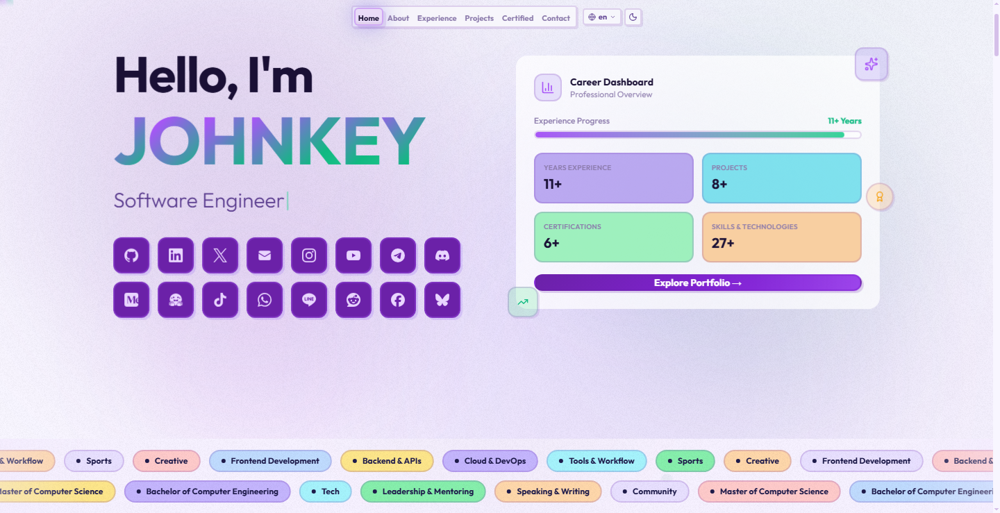

<h1 align="center">Crafted Personal Experience — Portfolio</h1>



Built for those who create, not just those who code. This is a streamlined personal portfolio website designed to turn your professional journey into a clean visual experience. Forget complex setups—everything you see is powered by a single data file. It’s modular, fully responsive, and crafted to let your work do the talking while the system handles the layout.

<div align="center">


[](https://the-portfolio-templates.vercel.app/)

</div>

## Features

- **Single-file data** — All content controlled from one file `src/data/content.ts` — name, bio, projects, experience, courses, socials, footer, everything.
- **Admin dashboard** — Browser-based editor at `your-domain.com/admin` with JWT login. Edit content without touching code.
- **8 languages** — EN, JA, ZH, ID, AR (RTL), RU, DE, FR — client-side switching with `next-intl`.
- **Project filters** — All / Featured / Works / Side-B categories with animated transitions.
- **About tabs** — Skills, Education, Hobbies, Other — tabs render only when data exists.
- **Performance** — FPS-capped canvas (24fps mobile, 30fps desktop), `content-visibility: auto`, lazy loading, React Compiler enabled.
- **SEO ready** — Open Graph, Twitter cards, dynamic `sitemap.xml` and `robots.txt` via Next.js route handlers.
- **Donate** — PayPal, ETH, BTC with QR code modals and copy-to-clipboard.
- **Responsive** — Mobile-first with Tailwind breakpoints, compact nav, adaptive canvas rendering.

> [!NOTE]
> For testing, dashboard panel use this `username:admin & password:admin123`
> Demo: [the-portfolio-templates.vercel.app](https://the-portfolio-templates.vercel.app/)
> Admin Panel: [the-portfolio-templates.vercel.app/admin](https://the-portfolio-templates.vercel.app/admin)

## Content Structure

All content lives in [`src/data/content.ts`](src/data/content.ts). Here's what you can configure:

| Export | Section | What it does |
|---|---|---|
| `roles` | Hero | Typewriter role texts |
| `siteConfig` | Global | Name, title, URL, avatar, socials, quote |
| `aboutData` | About | Intro, bio, skills, education, hobbies, other, auto-computed stats |
| `experienceData` | Experience | Work history with highlights and skills |
| `projectsData` | Projects | Side-B (tech) and Works (professional) projects |
| `coursesData` | Courses | Certificates with provider, date, and credential links |
| `navTabs` | Navigation | Tab order mapped to section IDs |
| `footerData` | Footer | Donate wallets (PayPal/ETH/BTC + QR) and footer links |

## Quick Start

> Git clone and install dependencies

```bash
git clone https://github.com/arcxteam/the-portfolio.git
cd the-portfolio
npm install
cp .env.example .env
```

> Development
```bash
npm run dev # development
```

> Production
```bash
pm2 start npm --name "portfolio" -- start
pm2 save
pm2 list | pm2 stop portfolio/all | pm2 kill
pm2 logs portfolio
```

Open [http://localhost:3000](http://localhost:3000) or your https://domain.com if have set up `NEXT_PUBLIC_SITE_URL` in `.env`.

## Environment Variables

Copy `.env.example` to `.env` and configure:

<details>
<summary><b>See Environment env.example Details</b></summary>

```
# ===== ADMIN AUTHENTICATION =====
# Generate JWT: openssl rand -hex 32
# Generate PASSWORD_HASH: node -e "require('bcryptjs').hash('yourpassword',12).then(h=>console.log(h))"

ADMIN_USERNAME=admin
ADMIN_PASSWORD=admin123
# ADMIN_PASSWORD_HASH=xx-bcrypt-hashed-password
JWT_SECRET=xx-random-secret-key-min-32-chars

# ===== SITE CONFIG =====
NEXT_PUBLIC_SITE_URL=https://YOUR-DOMAIN.COM
NEXT_PUBLIC_SITE_NAME=xxxx

# ===== SSL / SECURITY for production =====
# Set to true in production (requires HTTPS)
SECURE_COOKIE=false
```

</details>

| Variable | Description |
|---|---|
| `ADMIN_USERNAME` | Admin login username |
| `ADMIN_PASSWORD` | Admin login by password |
| `ADMIN_PASSWORD_HASH` | Admin login by hashing |
| `JWT_SECRET` | Secret key for JWT tokens (min 32 chars) |
| `NEXT_PUBLIC_SITE_URL` | Your production domain |
| `NEXT_PUBLIC_SITE_NAME` | Site display name |
| `SECURE_COOKIE` | Set `true` in production (requires HTTPS) |

**Generate secrets:**

```bash
# JWT Secret
openssl rand -hex 32

# Password hash (optional, for bcrypt auth)
node -e "require('bcryptjs').hash('yourpassword',12).then(h=>console.log(h))"
```

## Content Editing

### Option 1: Edit content.ts directly
- [x] All content is in `src/data/content.ts`. The structure is self-documented with inline comments and examples.

### Option 2: Edit Admin Dashboard in-browser
- [x] Navigate to `your-domain/admin`, log in with your credentials **(userame/password)**, and edit content from the browser.

> <mark>Note to apply changes in production you need Content saved! Run: npm run build && pm2 restart portfolio</mark>

## Project Images

Place images in `public/projects/`. Recommended specs:

| Type | Size | Format |
|---|---|---|
| Side-B projects | 1200 × 600 px (2:1) | PNG, WebP, JPG |
| Works projects | 1200 × 600 px (2:1) | PNG, WebP, JPG |
| QR codes | 500 × 500 px | PNG |

Keep files under 200~300 KB for optimal performance.

## Forking

1. Fork this repo
2. Edit → `src/data/content.ts`
3. Replace all placeholder data with your own
4. Add your avatar to `public/avatar.jpg`
5. Add project images to `public/projects/`
6. Configure `.env`
7. Deploy to Vercel / own hosting + domain
8. Nginx.conf setup `setup/nginx.conf`

## Deploy for Free

[](https://vercel.com/new/clone?repository-url=https://github.com/arcxteam/the-portfolio)

## License

[MIT](LICENSE) © GANI
